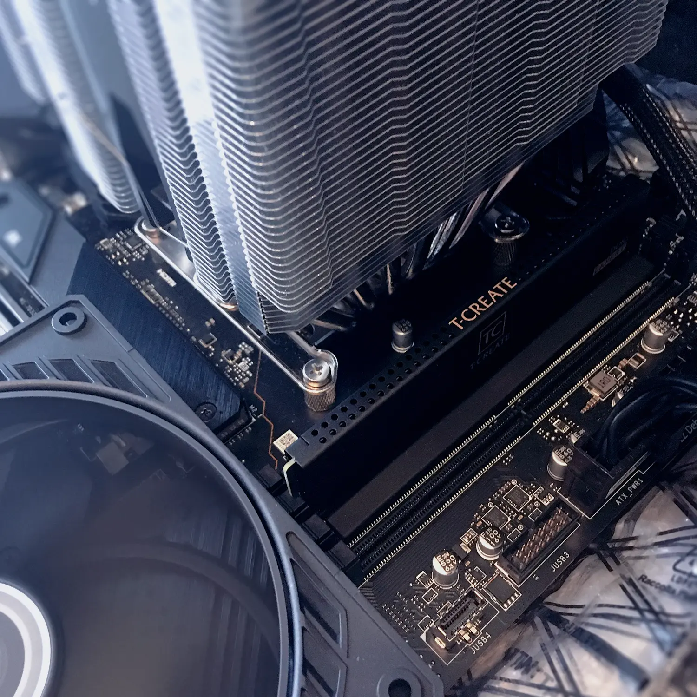

# DDR5 Recovery Kit

Tools for analyzing, dumping, and writing contents of DDR5 RAM SPD EEPROM.

Only for DDR5. Only for Linux.

## Description

This software can be used to repair DDR5 memory modules with corrupted SPD EEPROM that got broken by poorly coded applications made by imbeciles, e.g. [OpenRGB](https://openrgb.org/), which fail to access devices on SMBus in a proper manner.

Over time this results in RAM SPD EEPROM contents becoming increasingly filled with junk to the point of system no longer recognizing certain memory sticks and eventually even failing to boot at all. Typical symptoms include: having just 16 GB of RAM as reported by operating system (whereas you actually got two 16 GB modules installed and should have 32 GB available), RAM not being reported correctly in diagnostic software (CPU-Z, AIDA64, etc.), having messed up serial or part numbers with weird symbols, absurd timing values, running on wrong speed and with incorrect timings not advertised on a RAM package by manufacturer (can be noticed in BIOS), experiencing blue screens and kernel panics in relation to memory errors due to all of the above.

With the provided tools you can:

  * Dump the contents of your DDR5 RAM SPD EEPROM.
  * Verify the integrity of dumped ROM by computing and comparing CRC checksum(s).
  * Flash a working dump (if you got one) to repair broken RAM module(s).
      * Where do you get a working dump? That’s a good question, especially if all your modules are already tainted and you no longer have a single good stick to get a perfect dump from. Try asking on popular computer hardware boards and on Reddit. Chances are there will be people willing to help, provided your RAM kit isn’t too rare or you can identify a compatible one.
      * Consider RMA if your RAM is still under warranty. Actually, consider RMA first, before trying to use this software to repair the kit yourself, because chances are you are just going to break it even more.
      * Share this page to bring more public awareness to this issue of DDR5 RAM failing because of subtle SPD corruption by software.
  * Check RSWP[^1] status and add RSWP to your RAM modules to prevent their accidental corruption by junk software again.
      * Only for very experienced and knowledgeable users who understand what they are doing and realize the potential danger involved.

[^1]: Reversible software write protection. The “reversible” in this abbreviation is a misnomer. Once added by software means (e.g. via SMBus on your mainboard), it is not really reversible without a dedicated hardware DDR5 RAM programming device. So it is “reversible” in a sense that it *can* still be reversed, – just no longer by software means, which were used to add it in the first place.

## Installation

Just clone this repository. `ddr5-spd-recovery` depends on:

  * `python`
  * `i2ctools`
  * `dmidecode`

You must install dependencies before you can use all provided scripts. The package names may be different in your Linux distribution.

## How to Use

There are five utilites provided in total.

  * `spdread`: Dump the contents of the specified DDR5 SPD EEPROM.
  * `spdwrite`: Flash the SPD ROM image to the specified DDR5 SPD EEPROM.
  * `spdcheckrswp`: Check the RSWP status on all blocks of the specified DDR5 module.
  * `spdsetrswp`: Set the RSWP for the specified blocks of the DDR5 EEPROM __*(very dangerous)*__.
  * `spdinfo`: Output human-readable information obtained from SPD ROM image: manufacturer, date of production, serial number, part number, and, most importantly, CRC values of all available sections. Each present XMP profile block and EXPO section have their own associated CRC values separate from the main section CRC, which is located at byte offset `510` in the image.

All tools except `spdinfo` must be invoked as root. Run each script with the `--help` argument for detailed usage instructions.

*Before you start, make sure there are no other applications or services running that could potentially access SMBus.* Any concurrent access to SMBus can lead to data corruption, even if it is synchronized. Although proper synchronization guarantees data integrity on a byte level, there’s no such guarantee when larger transfers are involved. So one application might switch EEPROM virtual page address to a different one in-between two byte reads (or writes) done by another application, leading to data being received from or sent to the wrong place inside EEPROM, which in case of writes can be catastrophic.

An appropriate kernel module must be loaded in order to access RAM SPD chip(s) via SMBus. On Intel it is `i2c_i801`:

```sh
modprobe i2c_i801
```

On recent AMD platforms it should be `i2c_amd_mp2`:

```sh
modprobe i2c_amd_mp2
```

You will also need `i2c_dev` and `ee1004` modules loaded for `i2ctools` to work, regardless of your platform.

The `SPD Write Disable` option (or similar) in your mainboard BIOS must be set to `False`. This is required to gain access to full 1024 bytes of DDR5 EEPROM. If you don’t configure this option correctly in BIOS and attempt to dump DDR5 SPD ROM with `spdread.py`, it will most likely fail with an I2C I/O error.

Verify that you can talk to I2C devices by listing all available buses:

```sh
i2cdetect -l
```

In the output of this command, find a single bus that belongs to your mainboard SMBus controller. It might look like this:

```
i2c-11    smbus    SMBus I801 adapter at efa0    SMBus adapter
```

Take note of its number: __11__. This is the bus on which you can access SPD chip device(s) of your RAM. They should be available at the address range from `0x50` to `0x57`, with the RAM stick installed in a priority slot available at `0x51` (second slot of DIMM A channel and second from left). Therefore the second RAM module, if installed properly, will be at `0x53` (second slot of DIMM B channel, fourth slot from left). On a typical consumer board with all four RAM slots populated the other modules would be at `0x50` (leftmost) and `0x52` (third) respectively.

You can now dump the contents of SPD EEPROM from one of your DDR5 RAM modules:

```sh
sudo ./spdread.py --bus 11 --dimm 0x51
```

The ROM dump file will be saved in the current directory with the name `dimm81.spd`.

Be sure to verify the integrity of the dump:

```sh
./spdinfo.py --file dimm81.spd
```

The CRC values in the ROM must all match their respective computed values. If they don’t, this means the ROM is damaged: either due to previous illegal writes to it or because it couldn’t be read correctly from the SPD EEPROM device. You should delete it to avoid flashing it somewhere accidentally.

An example of `spdinfo` output for a known good dump from the TEAMGROUP T-Create Expert 6000 CL38 module:

```
Manufacturer: 04ef
Produced: 37/2023 (11 Sep)
S/N: 0104eef6
P/N: UD5-6000
Main CRC: 0x8021 (0x8021)
  XMP profile #1 CRC: 0xa5f (0xa5f)
  XMP profile #2 CRC: 0xac4 (0xac4)
  EXPO CRC: 0x9fe2 (0x9fe2)
```

Once you are done working with RAM SPD, reboot the system and change the `SPD Write Disable` BIOS option back to `True` (or whatever is an equivalent in your case, with the same meaning), save changes and reboot again.



*On the photo above: TEAMGROUP T-Create Expert module on a reanimation table after having too much RGB. This particular module was successfully recovered by flashing its SPD EEPROM with a known working dump.*

## Preventing DDR5 SPD Corruption

It must be noted that DDR5 SPD appears to be more susceptible to accidental corruption, at least compared to previous DDR generations.

You must never run your system with `SPD Write Disable` option set to `False` in BIOS as a norm, even if your RAM kit requires it to control RGB, – it is better to be left without fancy lighting effects than without working memory.

Avoiding the use of third-party RGB and fan control software will help minimize the risk. OpenRGB is one notable offender which has been [proven](https://www.overclock.net/threads/teamgroup-ddr-7600-openrgb-killed-the-modules-trying-to-use-thaiphoon-burner-to-recover-them.1805037/) to [corrupt](https://www.overclock.net/threads/gskill-ddr5-spd-suddenly-stopped-working.1804882/) DDR5 SPD EEPROM contents [many](https://www.reddit.com/r/OpenRGB/comments/128ilh6/nonrgb_gskill_ddr5_spd_read_failure_after_using/) [times](https://www.reddit.com/r/OpenRGB/comments/zloyp2/openrgb_killed_the_leds_of_my_new_ram/), even if RAM didn’t have RGB leds. I.e. you might have used it to configure the lighting color of your RGB fans, without touching anything related to memory, and still end up with corrupted RAM SPD. This software is a public hazard and must be avoided.

However, even official mainboard vendor software should be limited in usage and, at best, avoided completely, too.

Running old diagnostic and system information software that hadn’t been properly updated to work with DDR5 RAM might result in corruption as well. Such programs typically gain access to RAM SPD in order to report detailed memory information. A program that would attempt to work with DDR5 SPD as if it was from DDR4 can wreak havoc on it.

Finally, running multiple diagnostic or control applications side-by-side is yet another factor that can contribute to SPD corruption. All such applications have to rely on a low-level kernel driver for shared SMBus access. if such driver is not fully compatible with operating system or fails to properly serialize concurrent access to SMBus devices via a lock mechanism, bad things are guaranteed to happen. Therefore you must use only recent up-to-date versions of known and established software of this kind, apps which have proven to work without issues at least in the recent past.

A universal piece of advice that can be given is if you happen to use any software that performs low-level access to system components and it appears to behave erratically, – stop using it immediately and discard it.

### A Note on RSWP

One radical measure that can be done to prevent important parts of SPD EEPROM from corruption (JEDEC, XMP, EXPO sections) is setting RSWP[^1] bit for certain EEPROM blocks. A protection of this kind will prevent overwriting of protected blocks even if `SPD Write Disable` BIOS option is set to `False`. However, the important downside of this method is that once set, such protection cannot be removed without a dedicated hardware DDR5 RAM programmer device.

(Normally, DDR5 RAM is supposed to come with RSWP protection bit already set on all important blocks from factory, and most kits do. Unfortunately, this hadn’t always been the case. Early revisions of TEAMGROUP and G.SKILL DDR5 RAM are notorious for having no protection whatsoever.)


*New revisions of TEAMGROUP T-Create Expert RAM come with RSWP set for the most important blocks. It’s a big improvement, but the XMP and EXPO blocks are left unprotected. If they get corrupted and the system is configured to use XMP, which it very likely would be, it could become unbootable. In such case partial recovery can be possible by resetting BIOS which would disable XMP and fallback to a (protected) JEDEC profile.*

RSWP sees SPD EEPROM contents as divided into 16 blocks of 64 bytes each. For a normal non-RGB RAM module setting RSWP for blocks 0..13 is recommended. The last two blocks, 14 and 15, belong to user-programmable XMP section and must be left writable.


*The same T-Create Expert module with RSWP set for remaining blocks, including XMP and EXPO. Such module would no longer fail due to SPD corruption.*

RGB modules, on the other hand, are a challenge. In order to properly add RSWP protection you need to know what exact addresses are used to store RGB lighting settings. From there you can infer what blocks (in addition to 14 and 15) must be left writable in order to keep your RAM RGB lighting functional and configurable. (It is possible for certain RGB RAM to not store its LED settings inside SPD, in which case it relies completely on software to set lighting effects upon booting into operating system. If you know for sure this is the case with your RAM, you can set RSWP for the first fourteen blocks like with non-RGB variant.)

As you might have already unserstood, accidentally setting RSWP on a data block that is corrupted (before flashing it with valid data from a good ROM) or on a wrong RAM module will leave your RAM in a permanently broken state. (Unless you got access to a specialized hardware.)

*For this reason I give no direct instructions, advice, or suggestions on how to use `spdsetrswp.py` script. It is entirely up to you to take this risk and face any potential devastating consequences.*

*You __have been__ warned.*

## Disclaimer

Reading from and writing to devices via SMBus is a high risk operation which can potentially result in data corruption and hardware failure if done improperly. `ddr5-spd-recovery` is provided publicly without warranty of any kind. Although every step was taken to ensure decent code quality, correctness of operation, and overall reliability of the software, it is not possible to guarantee fault-free execution in your particular environment and with your hardware. You should understand what you are doing and exercise extreme caution when using this software. The author of this software takes no responsibility for any damages that can happen due to use or misuse of this software.

In legal terms:

```
THE SOFTWARE IS PROVIDED “AS IS”, WITHOUT WARRANTY OF ANY KIND,
EXPRESS OR IMPLIED, INCLUDING BUT NOT LIMITED TO THE WARRANTIES
OF MERCHANTABILITY, FITNESS FOR A PARTICULAR PURPOSE AND
NONINFRINGEMENT. IN NO EVENT SHALL THE AUTHORS OR COPYRIGHT
HOLDERS BE LIABLE FOR ANY CLAIM, DAMAGES OR OTHER LIABILITY,
WHETHER IN AN ACTION OF CONTRACT, TORT OR OTHERWISE, ARISING
FROM, OUT OF OR IN CONNECTION WITH THE SOFTWARE OR THE USE OR
OTHER DEALINGS IN THE SOFTWARE.
```

See the [license](LICENSE.md).

* * *

If you find [ddr5-spd-recovery](https://github.com/ubihazard/ddr5-spd-recovery) useful, you can [buy me a ☕](https://www.buymeacoffee.com/ubihazard "Donate").
